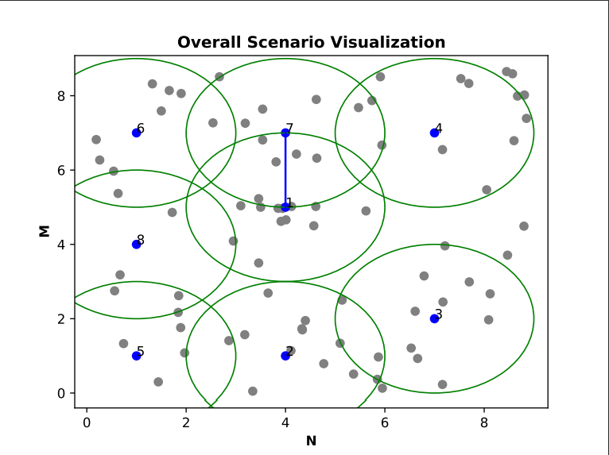

# UAV_GRN_DRN

This is a repository for creating a UAV network based on the GRN graph using python.

## Requirements

You need python and following packages to run this code

[python3.x](https://www.python.org/downloads/)  
[networkx](https://networkx.github.io/)  
[matplotlib](https://matplotlib.org/)  
[numpy](https://numpy.org/)  
[pandas](https://pandas.pydata.org/)  
[flask](https://flask.palletsprojects.com/en/1.1.x/)

## Installation

First you need to install python3.x to run this project. To install issue the following command.

```bash
sudo apt-get install python3.6
```

Install the python packages by issuing the follwing commands in your terminal

``` bash
pip install networkx
pip install matplotlib
pip install numpy
pip install pandas
pip install flask
```

## Cloning the repository

Clone the repository using the following command:

``` git
git clone git@github.com:Krishnandu91/UAV-GRN-DRN.git
```

## Exceution

If you want to run only one time then goto UAV-GRN-DRN folder and type the following command

``` bash
python main.py
```

If you want to run this script multiple number of times issue the following command

For Linux users

``` bash
./runner.sh
```

For Windows users

``` bash
runner.bat
```

If you want to run over all possible configuration on learning rate, exploration rate and discount factor issue the following command

``` bash
python runner_python.py
```

NOTE: If you want to change the user location file then you need to update the user_location.json file. You can generate user locations in either of the ways mentioned below.

## Generate user locations

If you want to generate random location for the user issue the following command

``` bash
python3 user_secnario_producer.py
```

If you want to generate uniform location for the user then use the following command

```bash
python3 user_scenario_cluster.py
```

## Sample Output Graph



In the above image the red cell are UAVs. The circles are their connection range. The blues cells are UAVs where ground user is placed just below it i.e. the UAV is on the top of the ground user. The black cells are the positions of ground users. The light blue lines denotes the edge between two UAVs.

## Clear all the output files

To clear all output files just issue the following command

``` bash
./fresh_analysis.sh
```

## Issues

Feel free to raise an issue if you find any thing incorrect or facing some difficulties in running the code.

## License

[MIT](https://opensource.org/licenses/MIT)
