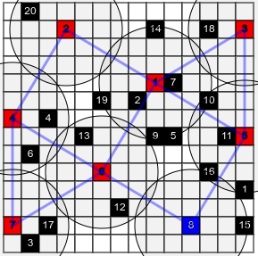

# UAV_GRN_DRN

This is a repository for creating a UAV network based on the GRN graph using python.

## Requirements

You need python and following packages to run this code

[python3.x](https://www.python.org/downloads/)  
[networkx](https://networkx.github.io/)  
[matplotlib](https://matplotlib.org/)  
[numpy](https://numpy.org/)  
[pandas](https://pandas.pydata.org/)  

## Installation

Install the python packages by issuing the follwing commands in your terminal

``` bash
pip install networkx
pip install matplotlib
pip install numpy
pip install pandas
```

## Cloning the repository

Clone the repository using the following command:

``` git
git clone git@github.com:Krishnandu91/UAV-GRN-DRN.git
```

## Exceution

If you want to run only one time then goto UAV-GRN-DRN folder and type the following command

``` bash
python main.py
```

If you want to run this script multiple number of times issue the following command

For Linux users

``` bash
./runner.sh
```

For Windows users

``` bash
runner.bat
```

If you want to run over all possible configuration on learning rate, exploration rate and discount factor issue the following command

``` bash
python runner_python.py
```

NOTE: If you want to change the user location file then you need to update the user_location.json file. You can generate user locations in either of the ways mentioned below.

## Generate user locations

If you want to generate random location for the user issue the following command

``` bash
python3 user_secnario_producer.py
```

If you want to generate uniform location for the user then use the following command

```bash
python3 user_scenario_cluster.py
```

You can also generate user location of various size grids and varying number of users. To do this run the [html file](./html/users_loc_inp.html) which is located in html folder in the root directory in any browser. If you enter value greater than 30 then we will divide the whole grid into subgrids to size 30. The division will be row wise i.e. if you enter grid size as 100 then this will divide the grid into 16 subgrids according to the image shown below


## Sample Output Graph



In the graph shown above the nodes in brown color are the group of users which are covered by the UAV which is connected with it which is shown in blue color in the graph. The edges in red color are connections from UAV to Ground User Group and edges in blue color are connections from one UAV to other.

## Clear all the output files

To clear all output files just issue the following command

``` bash
./fresh_analysis.sh
```

## Issues

Feel free to raise an issue if you find any thing incorrect or facing some difficulties in running the code.

## License

[MIT](https://opensource.org/licenses/MIT)
